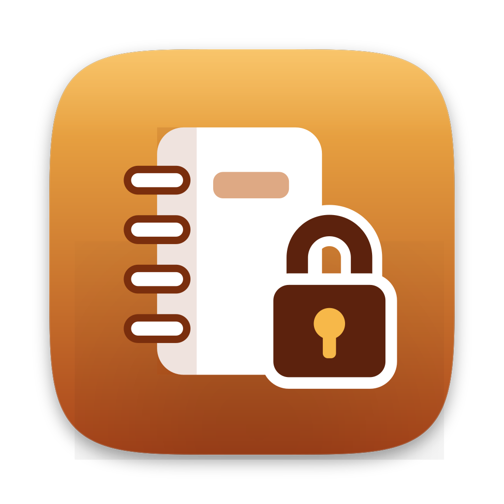
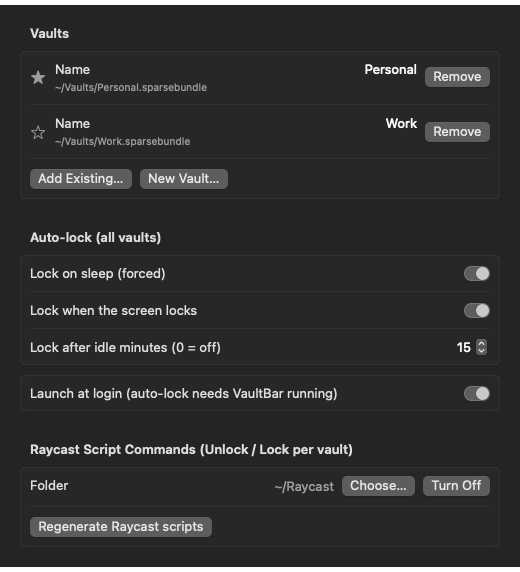

<div align="center">



# VaultBar

### Your encrypted vaults, one click from the menu bar.

A small native **macOS** menu bar app that locks and unlocks encrypted disk-image vaults
(AES-256 APFS sparse bundles), and locks them again on sleep, screen lock or idle.
The password is never stored anywhere.

[](https://www.apple.com/macos/)
[](https://swift.org)
[](https://github.com/roypadina/VaultBar/actions/workflows/ci.yml)
[](LICENSE)
[](CONTRIBUTING.md)
[](https://github.com/roypadina/VaultBar/stargazers)
[](https://ko-fi.com/roypadina)

<br>



</div>

---

## Features

- **One click** — left-click the menu bar icon to lock or unlock your default vault. Right-click (or Control-click)
  for every vault (Unlock… / Lock, **Open in Finder** or **Unlock & Open…**), Lock All, New Vault…, Add Existing
  Vault…, Settings….
- **Open in Finder after unlocking** (optional setting), or per vault with Open / `vaultbar://open`.
- **Read-only unlock**: per vault by default, or once with ⌥ in the menu ("Unlock Read-Only…"), `?readonly=1` or
  `vaultbar unlock --readonly`. The password prompt shows the mode ("Work — Read-Only" with a blue icon, "Work — Read & Write"
  with an amber one) with a **Read & Write | Read-Only** switch you can flip before pressing Enter (⌘R). Nothing can be written
  to a read-only mount, and a forced lock can't lose anything.
- **Private mount**: per vault, mount at a folder you choose (e.g. `~/Vaults/mnt/Work`) instead of `/Volumes`, and
  optionally **hidden from Finder** (`-nobrowse`: not in the sidebar, Desktop or file pickers). The folder exists
  only while the vault is unlocked: VaultBar creates it (mode 700) right before unlocking and removes it after
  locking, also when the vault is ejected some other way (Finder, `hdiutil detach`, another app), so a locked vault
  leaves no empty folder anything could write into. It refuses a non-empty folder and any
  folder that syncs to a cloud.
- **Command line**: `vaultbar status --json`, `vaultbar path Work`, `vaultbar unlock Work --wait 60`, … (see below).
- **Panic lock**: a global hotkey (default ⌃⌥⌘L, no Accessibility permission) locks every vault at once, forcing busy
  ones unless you turn that off. ⌥-click the icon to lock all without forcing; `vaultbar://lockall`.
- **Notifications** when idle or screen-lock auto-lock locks a vault (sleep locks are silent), before idle auto-lock
  force-locks a busy one (with **Keep unlocked 15 min**), and when a lock fails (sleep included). The wording never names a vault: notifications can show on the lock screen.
- **History**: the menu shows the last event ("Last: Locked Work (idle 15 min), 10:42"); **History…** lists the last
  50. Kept in memory only.
- **Change password…** (Settings, per vault, while it's locked), with a check that the new password opens the image.
- **Unlock prompt hints**: Caps Lock and the current keyboard layout, the usual causes of a "wrong" password.
  VoiceOver announces the prompt; Settings controls are labelled.
- **Password popup** that never saves anything: no Keychain, no "remember password", no clipboard.
- **Auto-lock**, for every vault:
  - on **sleep**: forced, immediately;
  - on **screen lock**: clean unmount; if a file is still open, forced after 30 s, but only if the screen is still locked;
  - after **N idle minutes**: clean unmount; if busy, forced after 60 s, but only if you're still away.
- **Pause auto-lock for 1 hour** — for long unattended jobs that work inside a vault (idle only counts keyboard and
  mouse). Sleep still locks. The icon gets a warning badge; the pause ends after an hour, on Resume, or on quit.
- **New Vault…** creates an encrypted AES-256 APFS sparse bundle, warns about weak passwords and about folders that
  sync to a cloud (iCloud Drive, Desktop & Documents, `~/Library/CloudStorage`, Syncthing, Synology Drive).
- **Add Existing Vault…** for any encrypted `.sparsebundle` or `.dmg` (unencrypted images are rejected).
- **URL scheme** and optional **Raycast Script Commands**.
- **Always running**: the login item is a LaunchAgent (`~/Library/LaunchAgents/com.padina.vaultbar.login.plist`),
  so macOS starts VaultBar at login and restarts it if it ever crashes (not after you choose Quit). Exactly one copy
  runs, and (from 0.2.1 on) never zero: when one copy hands over to another (a copy you started yourself handing
  over to the supervised one once it's idle, or an upgrade), the old copy quits only after the new one has confirmed
  it is running. No Dock icon.
- **Quit asks first** while a vault is unlocked, since auto-lock stops while VaultBar is closed:
  **Lock All & Quit**, **Quit** or **Cancel**.

Menu bar icon: a monochrome notebook with a closed padlock when everything is locked; an **amber open padlock** as
soon as any vault is unlocked (however it was mounted: VaultBar, Finder, Terminal); an **orange warning badge** while
auto-lock is paused.

## Install

> **Requires macOS 14 Sonoma or newer.**

```bash
brew install --cask roypadina/tap/vaultbar
```

**Not notarized.** VaultBar is ad hoc signed (no paid Apple Developer ID), so macOS may block the first launch. Either
right-click it in `/Applications` → **Open** (then **Open Anyway** in System Settings → Privacy & Security),
or clear quarantine once:

```bash
xattr -dr com.apple.quarantine /Applications/VaultBar.app
```

Or download `VaultBar.zip` from the [latest release](https://github.com/roypadina/VaultBar/releases/latest),
unzip it and move `VaultBar.app` to `/Applications`.

**Upgrades** (`brew upgrade --cask vaultbar`) are picked up automatically: within about 30 s, once nothing is in
progress, the running VaultBar starts the new version and quits as soon as it has taken over, so from 0.2.1 on
auto-lock never stops. The upgrade from 0.2.0 or older still runs the old version's restart, which can leave
VaultBar stopped for 1–2 s (coming from 0.1.2 or older, quit VaultBar and open it once after upgrading).

## Usage

1. Click the menu bar icon → **New Vault…** (or **Add Existing Vault…**).
2. **Save the password in your password manager first.** There is no recovery key.
3. Left-click the icon to unlock or lock. The password prompt is ready to type right away (also when opened from
   Raycast or a `vaultbar://` link); Enter unlocks, Esc cancels. The vault mounts in Finder like any disk.
4. Once per new vault, stop Spotlight from indexing it (VaultBar shows the command with a Copy button):
   `sudo mdutil -i off "/Volumes/<volume name>"`.

If a vault is busy when you lock it, VaultBar asks before forcing it. Forcing can lose unsaved changes in open apps.

Hold ⌥ in the menu to swap **Unlock…** for **Unlock Read-Only…** (or **Unlock Read-Write…** for a vault that unlocks
read-only by default). ⌥-click the menu bar icon to lock everything. The menu shows "(read-only)" for read-only mounts.

## Config

`~/.config/vaultbar/vaults.json` (mode 600, never holds a password). Settings edits it for you:

```json
{
  "defaultVault": "Personal",
  "autoLock": { "onSleep": true, "onScreenLock": true, "idleMinutes": 15 },
  "launchAtLogin": true,
  "raycastScriptsDir": "~/Raycast",
  "openAfterUnlock": false,
  "panicHotkey": "ctrl-opt-cmd-L",
  "panicForces": true,
  "vaults": [
    { "name": "Personal", "imagePath": "~/Vaults/Personal.sparsebundle" },
    { "name": "Work", "imagePath": "~/Vaults/Work.sparsebundle",
      "mountPoint": "~/Vaults/mnt/Work", "hidden": true, "readOnly": true }
  ]
}
```

- `idleMinutes: 0` turns idle locking off. `raycastScriptsDir` is optional (no scripts without it).
- `openAfterUnlock: true` opens the vault in Finder after every unlock: the menu bar click, the menu's Unlock…,
  `vaultbar://unlock` and the Raycast Unlock script. Default `false`.
- Per vault, all optional: `mountPoint` (a private mount folder; without it macOS uses `/Volumes/<volume>`), `hidden`
  (`-nobrowse`), `readOnly` (the default unlock mode).
- `panicHotkey`: `ctrl-opt-cmd-L` (default), `ctrl-opt-cmd-K`, `ctrl-shift-cmd-L`, `opt-shift-cmd-L` or `off`.
  `panicForces: false` makes it ask for busy vaults instead of forcing them.
- Vaults are matched by their image file, so a volume that macOS renamed to `Personal 1` still shows the right state.
- Removing a vault in Settings only removes it from the list. VaultBar never deletes an image file.

## URL scheme

```
vaultbar://unlock/<name>
vaultbar://lock/<name>
vaultbar://toggle/<name>
vaultbar://open/<name>
vaultbar://unlock/<name>?readonly=1
vaultbar://lockall
```

The name is URL-encoded (`My%20Vault`); an empty name means the default vault.

- **unlock** shows the password popup; it does nothing if the vault is already unlocked. With `openAfterUnlock`,
  Finder opens the vault afterwards.
- **lock** locks (asks before forcing a busy vault). **toggle** locks or unlocks.
- **open** opens the vault in Finder; if it is locked, it asks for the password first, then opens it.
  Cancel does nothing.
- `?readonly=1` (or `0`) overrides the vault's read-only setting for that unlock. **lockall** locks every vault
  (asks before forcing a busy one).

## Command line

The cask links `vaultbar` into your PATH (built from source: `/Applications/VaultBar.app/Contents/MacOS/VaultBar`
with the same arguments).

```
vaultbar status [--json]
vaultbar path [<vault>]
vaultbar lock [<vault>] [--wait <seconds>]
vaultbar lock --all [--wait <seconds>]
vaultbar unlock [<vault>] [--readonly] [--wait <seconds>]
vaultbar open [<vault>]
```

No `<vault>` means the default vault. `status` and `path` only read; `lock`, `unlock` and `open` send the matching
`vaultbar://` link, which also starts VaultBar if it isn't running. **`unlock` never takes a password** (not from
arguments, the environment or stdin): it opens the same popup, and a person types it. `--wait` waits until the vault
is unlocked (then prints its path) or locked.

| Exit code | Meaning |
|---|---|
| 0 | done |
| 1 | locked / not mounted (`path`), or VaultBar couldn't be reached |
| 2 | no such vault (or no default vault) |
| 3 | `--wait` timed out |
| 64 | usage error (unknown command or option) |

```bash
vaultbar unlock Work --wait 60 && my-agent --root "$(vaultbar path Work)"; vaultbar lock Work
```

## Raycast

Pick your Raycast script directory in **Settings → Raycast Script Commands**. VaultBar then keeps three scripts per
vault there, **Unlock**, **Lock** and **Open** (`vaultbar-unlock-<slug>.sh`, `vaultbar-lock-<slug>.sh`,
`vaultbar-open-<slug>.sh`). The slug is the vault name in lowercase, with spaces and symbols turned into dashes
(e.g. `My Vault` → `my-vault`). VaultBar updates the scripts on every launch and when you add, rename or remove a
vault. Each script only runs `open "vaultbar://unlock|lock|open/<name>"`; the password goes into VaultBar's popup,
never through Raycast. VaultBar only ever deletes scripts it wrote itself (marked
`# @raycast.packageName VaultBar`).

## Security model

- **The password is never stored**: not on disk, in the Keychain, in the config, in logs, in process arguments,
  environment variables or the clipboard.
- It reaches `hdiutil attach -stdinpass` / `diskutil image --stdinpassphrase create` only through a pipe on the child
  process's stdin, closed right after writing. An empty password is refused before any tool runs, so the system's
  own disk-image password dialog (with its "Remember password in my keychain" box) never appears.
- Password bytes are zeroed after use. Best effort: the Swift `String` the text field hands over can't be wiped.
- **Change password…** uses `diskutil image --stdinpassphrase chpass` (old and new password on stdin), then checks
  that the new one opens the image. It re-wraps the key; it does not re-encrypt the data, so copies of the image made
  before the change (backups, snapshots) still open with the old password. For a full re-key, create a new vault and
  copy the files over.
- The command line and the URL scheme have no password parameter; unlocking always means a person typing.
- Notifications never name a vault (they can show on the lock screen). History is kept in memory only.
- Lock events are logged (vault name and reason only) under the `com.padina.vaultbar` subsystem:
  `log show --predicate 'subsystem == "com.padina.vaultbar"' --info --last 1h`.
- Encryption is macOS's own (DiskImages, AES-256). VaultBar is a front end; it makes no network connections.

## Where plaintext can leak

VaultBar keeps the vault itself locked, but macOS and your apps can keep copies or traces of what you opened:

- **QuickLook thumbnails**: previews of vault files stay in the QuickLook cache after locking. Clear it with
  `qlmanage -r cache`.
- **Recent items**: apps' Open Recent lists and Finder's Recents remember file names and paths (in
  `~/Library/Application Support/com.apple.sharedfilelist`). The files stay locked; the names don't.
- **Screenshots** of vault content land on your Desktop (or wherever screenshots go), outside the vault.
- **Clipboard managers** keep whatever you copied from vault documents.
- **Local AI / LLM apps** store conversations, tool results and logs (often in a folder in your home directory).
  Anything a model read from the vault can stay there.
- **Spotlight**: turn indexing off for each vault once (`sudo mdutil -i off "<mount point>"`).

Safe by construction: the volume's own Trash (`.Trashes`) and document versions (`.DocumentRevisions-V100`) live
inside the encrypted image; swap is encrypted on Apple silicon and with FileVault; Time Machine backs up the image's
encrypted bands, not the decrypted files.

## Build from source

Requires Xcode or the Xcode command line tools (Swift 6).

```bash
git clone https://github.com/roypadina/VaultBar.git
cd VaultBar
swift test
Scripts/package_app.sh               # writes dist/VaultBar.app
ditto dist/VaultBar.app /Applications/VaultBar.app
open /Applications/VaultBar.app
```

`RELEASE=1 Scripts/package_app.sh` also writes `dist/VaultBar.zip`. `Scripts/make_icons.sh` regenerates the icons
from `Assets/icons/*.svg` (needs `brew install librsvg`). An end-to-end test with a throwaway vault in `.scratch/`:
`VAULTBAR_E2E=1 swift test --filter endToEnd`. `Scripts/e2e_launchd.sh` tests "always one copy running" against
launchd (hand-off, an upgrade, a crash) with a separate headless test build. See [CONTRIBUTING.md](CONTRIBUTING.md).

## Uninstall

```bash
brew uninstall --zap --cask vaultbar
```

Or run `vaultbar --unregister-login-item` (or turn off **Launch at login** in Settings), quit it, drag
`/Applications/VaultBar.app` to the Trash, and delete `~/.config/vaultbar`. Your vault images stay where they are.
`--unregister-login-item` locks every unlocked vault first; if one is busy it stops and changes nothing, unless you add
`--force` (force-locks it; unsaved changes in open apps may be lost).

## Support

If VaultBar keeps your private files one click away (and locked when you walk off), you can support its
development — it's optional and always appreciated.

[](https://ko-fi.com/roypadina)

A ⭐ on the repo helps just as much.

## License

[MIT](LICENSE) © Roy Padina
